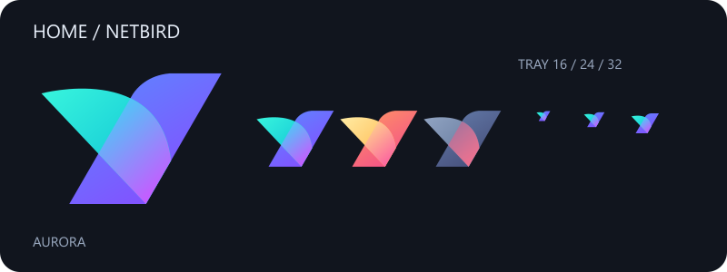

# homeNetbird

A Windows installer for a second, independent NetBird connection, including the patched daemon, isolated service, Aurora tray indicator and native CLI wrapper.



Keep the official NetBird GUI for your primary network and run Home alongside it. Hover over the Aurora icon to see its IP and connected peer count, double-click for detailed status, or use the menu to connect, disconnect and choose Home routes.

**[Download homeNetbird-Setup.exe](https://github.com/nd4y/homeNetbird/releases/download/v1.1.0/homeNetbird-Setup.exe)** · **[Release files and checksums](https://github.com/nd4y/homeNetbird/releases/tag/v1.1.0)**

Скачай установщик, запусти его, нажми **Install & connect Home**, подтверди UAC и войди в свою домашнюю сеть через браузер. Основной GUI остаётся для рабочей сети. После входа выбери нужные маршруты в отдельном окне; пересечения с другими интерфейсами будут отмечены.

## Status colors

| Icon | Meaning |
|---|---|
| Cyan / electric blue / violet | Connected, Management and Signal reachable |
| Gold / coral | Connected, with a Management or Signal problem |
| Muted blue / rose | Disconnected |
| Slate | Starting, daemon unavailable, or status request failed |

The icon preserves NetBird's bird silhouette with a new Aurora color treatment. ICO files contain 16, 20, 24, 32, 48 and 64 px frames. The preview above is the same artwork used by the indicator.

## Requirements

- Windows x64 with Windows PowerShell 5.1 and an interactive desktop session.
- Administrator approval for Windows service/driver installation.
- A Home NetBird account or self-hosted management server supporting browser sign-in.

The full release bundles a NetBird 0.71.4-derived Home daemon, unmodified signed Wintun 0.14.1 and the official primary NetBird 0.71.4 MSI. The MSI runs only if primary NetBird is absent. Existing primary installations and profiles are not upgraded or switched. Concurrent-operation testing used primary NetBird 0.71.4; other primary versions still need testing. See [NetBird issue #446](https://github.com/netbirdio/netbird/issues/446) for background.

## Install

Download and run **homeNetbird-Setup.exe**, or extract the full release ZIP and double-click **Setup.cmd**. In the wizard:

1. Keep the cloud management URL or enter your Home self-hosted HTTPS URL.
2. Optionally enter extra Home DNS domains, such as `home.example.com`.
3. Click **Install & connect Home** and approve Windows UAC.
4. Complete browser sign-in, then choose only needed Home routes.

The installer is unsigned; Windows may show an unknown-publisher/SmartScreen prompt. The embedded Wintun and original NetBird MSI retain their upstream signatures. Verify downloaded files against the release checksums if desired.

The daemon is installed in `%ProgramFiles%\homeNetbird`; private state and newly generated keys are protected in `%ProgramData%\homeNetbird`. The separate `NetbirdHome` service starts automatically with a delay. It uses `wt1`, UDP 51821 and control endpoint `127.0.0.1:41732`. The primary GUI daemon normally uses `127.0.0.1:41731`.

The installer refuses an existing `NetbirdHome` service, saved Home state, occupied ports or interface. It never overwrites your earlier manual installation. On a failed install, generated state is retained for recovery; inspect the reported error before removing leftovers or retrying.

To build the full package from a source checkout, run:

```powershell
powershell.exe -NoProfile -ExecutionPolicy Bypass -File .\Build.ps1
powershell.exe -NoProfile -ExecutionPolicy Bypass -File .\Package.ps1
powershell.exe -NoProfile -ExecutionPolicy Bypass -File .\Build-Setup.ps1
```

Go is needed only for source builds, not for installation from a release. The build was tested with Go 1.26.4. Source archives and upstream installer/driver downloads are pinned by SHA-256; `Patch-NetBird.ps1` contains the Windows isolation changes. A complete patched NetBird source archive is included in each release.

The user interface is copied to `%LOCALAPPDATA%\Programs\NetBirdHomeTray`, with Desktop/Startup shortcuts and a user PATH entry. Open a fresh terminal to use the CLI. The original tray-only installation path remains available as `Install-Tray.ps1` if you already have a separate daemon.

Tray-only optional switches: `-NoStartup`, `-NoDesktop`, `-NoPath`, `-NoLaunch`, and `-Destination <directory>`.

To run directly without installing:

```powershell
powershell.exe -NoProfile -STA -ExecutionPolicy Bypass -WindowStyle Hidden -File .\Home-Tray.ps1
```

Windows may put the icon in the tray overflow. Drag it into the visible notification area if needed. Only one indicator runs per Windows session. Exiting the indicator leaves the VPN connected.

## CLI

```powershell
homenetbird up
homenetbird down
homenetbird status -d
homenetbird status --json | ConvertFrom-Json
homenetbird routes list
homenetbird up --help
```

Arguments, subcommands, output and exit codes pass through to the native CLI. No arguments means `status`. The wrapper selects the secondary daemon and isolates its CLI `APPDATA` so it does not change the primary GUI's cached profile. `up` uses the last selected Home profile; caller flags retain their native meaning.

For a conventional secondary `default` profile, explicitly connect with:

```powershell
homenetbird up --profile default
```

Before a first-argument `up`, a read-only preflight checks the primary and secondary daemon IPs and rejects a matching identity. This is a basic IP comparison, not a complete duplicate-identity detector; both status endpoints must be available. Configuration-changing native commands and explicit daemon flags should be used deliberately.

## Configuration

Both tray and CLI use these environment variables:

| Variable | Default |
|---|---|
| `NETBIRD_HOME_BINARY` | Bundled `%ProgramFiles%\homeNetbird\netbird-home.exe`, falling back to official NetBird CLI |
| `NETBIRD_HOME_DAEMON_ADDR` | `tcp://127.0.0.1:41732` |
| `NETBIRD_PRIMARY_DAEMON_ADDR` | `tcp://127.0.0.1:41731` |
| `NETBIRD_HOME_CACHE` | `%LOCALAPPDATA%\NetBirdHomeCLI` |

Use local TCP daemon endpoints. Set user environment variables persistently if they must apply after sign-in, then restart the indicator. For a temporary session:

```powershell
$env:NETBIRD_HOME_DAEMON_ADDR = 'tcp://127.0.0.1:41732'
.\homenetbird.cmd status -d
```

## How it works and limitations

The daemon has a distinct Wintun GUID, `NetbirdHome` firewall rule names, `NetBird-Home-Match` NRPT names, and `NB_STATE_DIR`. Home is split-DNS only: it never assigns general DNS. Explicit wizard domains and selected domain routes are sent to Home's resolver; changes to service DNS settings request UAC and may briefly restart only Home. Router/IPv6/SSH serving is disabled initially. Forwarded client routes start disabled; the graphical route picker enables only your selected networks.

The tray polls `status --json` roughly every 10 seconds. Requests run hidden with asynchronous output reads and an 8-second timeout, keeping the menu responsive. A minimal last-transition record is written to the Home cache as `tray-status.json`; full peer details and keys are not stored there.

Connected status describes the daemon/control plane. It does not prove that every peer or service is reachable. DNS and routes remain the responsibility of the VPN configuration: Windows routes by destination IP, so identical IPs in two networks need explicit routing/address translation or separate network stacks. The indicator does not arbitrate conflicting DNS namespaces or routes.

Live checks covered the existing concurrent setup, native CLI detail/JSON/exit codes, icon frames, a fresh disconnected bundled daemon generating independent keys, route parsing/overlap detection, tray file installation and refusal to overwrite an existing Home service. A clean-PC elevated installation, complete new-account browser sign-in, GUI interactions, and next-sign-in startup have not been exercised end to end. Version 1.1.0 is therefore published as a preview release. `Test-Package.ps1` checks package hashes, scripts, icon frames and fresh idle-daemon initialization without registering a service or connecting a VPN.

## Uninstall

Exit the indicator from its menu, then run `Uninstall.ps1` in the installed user directory. It removes that installation's shortcuts and PATH entry. Add `-RemoveDaemon` to request UAC and remove the owned Home service. Primary NetBird stays intact. Home state/keys, CLI cache and machine binaries are retained for recovery; remove them manually only after deciding whether to keep a private backup. Never publish those state folders.

## Rebuild the artwork

Node.js is only needed to regenerate the committed icons, not to run the tray:

```powershell
npm install
npm run build:icons
```

## License

Project scripts: MIT. NetBird-derived client/artwork: upstream licenses in [NETBIRD-LICENSE](NETBIRD-LICENSE), the patched source release, and [NOTICE](NOTICE). Wintun's prebuilt license and dependency notices are in `licenses`. The primary NetBird installer is an unmodified upstream package. This is an independent community project with no NetBird endorsement.
